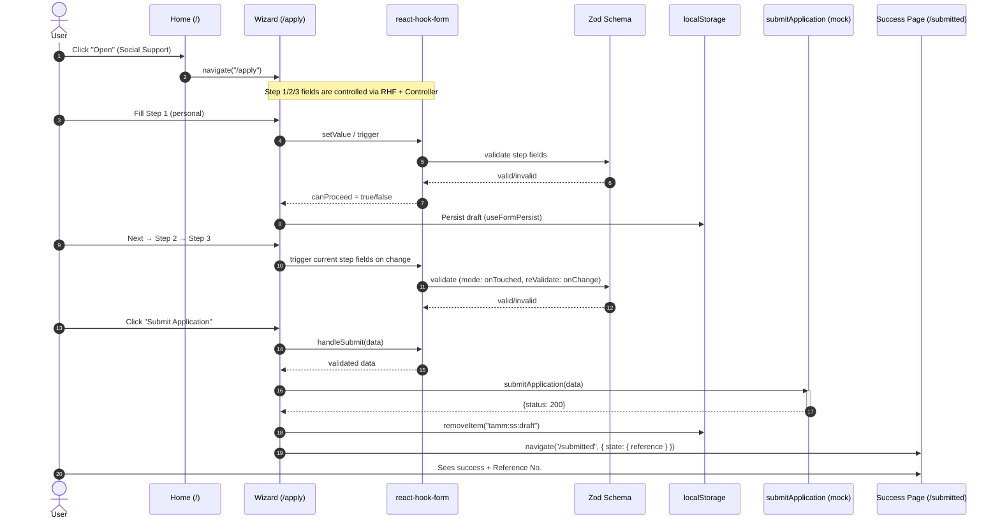

# Architecture

## Overview

**TAMM Social Support** is a Vite + React (TypeScript) SPA that guides citizens through a 3-step application wizard with i18n (EN/AR), accessibility, draft persistence, and an AI “Help Me Write” assistant.

## Tech Stack

- **Runtime:** Node 22, npm 10
- **Build:** Vite + React + TypeScript
- **UI:** Material UI (MUI)
- **Forms:** react-hook-form + Zod
- **i18n:** react-i18next
- **Routing:** react-router-dom
- **State:** React Context (lightweight) + component state
- **HTTP:** fetch/axios (mock submit)
- **Persistence:** localStorage (drafts)

---

## Project Structure

```
tamm-social-support/
├─ public/
├─ .env.example
├─ .gitignore
├─ index.html
├─ README.md
├─ Architecture.md   <-- this file
└─ src/
   ├─ main.tsx
   ├─ i18n.ts
   ├─ App.tsx
   ├─ assets/
   │  ├─ InnerBannerLightBG.jpg
   │  ├─ svgs/
   │  │  └─ tamm-log.svg
   │  └─ mock/
   │     └─ services.json
   ├─ components/
   │  ├─ NavBar.tsx
   │  ├─ LanguageSwitch.tsx
   │  ├─ FormStepper.tsx
   │  └─ HelpMeWriteDialog.tsx
   ├─ context/
   │  └─ AppContext.tsx
   ├─ hooks/
   │  └─ useFormPersist.ts
   ├─ pages/
   │  ├─ Home.tsx
   │  └─ form/
   │     ├─ Wizard.tsx
   │     ├─ Step1.tsx
   │     ├─ Step2.tsx
   │     ├─ Step3.tsx
   │     └─ SubmissionSuccess.tsx
   ├─ schema/
   │  └─ applicationSchema.ts   // buildApplicationSchema(t) + types
   ├─ constants/
   │  ├─ defaultValues.ts       // DEFAULT_VALUES
   │  └─ stepFields.ts          // STEP_FIELDS
   ├─ services/
   │  └─ api.ts                 // submitApplication (mock)
   └─ locales/
      ├─ en/translation.json
      └─ ar/translation.json
```

---

## App Flow

1. **Landing (/**)\*\*

   - Hero banner + services grid (cards).
   - “Social Support → Open” navigates to `/apply`.
   - Other services show a common **Coming Soon** dialog.

2. **Wizard (/apply)**

   - 3 steps with progress bar:

     1. Personal Information
     2. Family & Financial Info
     3. Situation Descriptions (+ “Help Me Write” AI)

   - Inline validation, “Next” disabled until the current step is valid.
   - Draft auto-save to localStorage.

3. **Submission**

   - Mock API call + 2.5s “Processing…” state.
   - On success → `/submitted` with generated reference number.

---

## Forms & Validation

- **react-hook-form** orchestrates the form via `<FormProvider>`; each step uses `useFormContext()` and `Controller` to bind MUI inputs.
- **Zod schema** is **i18n-aware**:

  - `buildApplicationSchema(t)` produces validation messages in the active language.
  - `Wizard.tsx` memoizes the schema by `i18n.language`.

- **Validation UX**

  - `mode: "onTouched"`, `reValidateMode: "onChange"`.
  - Errors show only after touch/typing (`fieldState.isTouched || isDirty`).
  - `STEP_FIELDS` lists per-step paths; `trigger()` checks current step to compute `canProceed`.
  - **Important:** Avoided `useWatch({ control })` on the whole form to prevent heavy re-renders.

**Snippet — enabling/disabling Next**

```ts
useEffect(() => {
  (async () => {
    const ok = await methods.trigger(STEP_FIELDS[active] as any, {
      shouldFocus: false,
    });
    setCanProceed(ok);
  })();
}, [active, methods]);
```

---

## Internationalization (EN/AR)

- **i18n bootstrap (`i18n.ts`)** loads `locales/en|ar/translation.json` and sets `document.dir` (`rtl` for Arabic).
- **LanguageSwitch** toggles language, persists to `localStorage`, updates dir.
- **Every visible string** comes from `t(...)` (labels, placeholders, buttons, dialogs).
- **Validation messages** localize via `buildApplicationSchema(t)`.

**Snippet — using i18n in fields**

```tsx
const { t } = useTranslation();
<TextField label={t("form.personal.name")} />
<MenuItem value="male">{t("options.gender.male")}</MenuItem>
```

---

## State Management

- **Global**: `AppContext` for toasts/notifications and other app-wide utilities.
- **Local**: Component state for dialog visibility, selected service, wizard step, and processing spinner.

---

## UI/Styling

- **MUI** with `sx` prop for theme-aware styles and responsive layout.
- **Cards grid**: equal visual height via `height` + text line-clamping (`WebkitLineClamp`), responsive columns using `sx` (`flexBasis`/`maxWidth`) to guarantee 4-up on desktop.
- **Accessibility**: labeled controls, ARIA where useful, keyboard-friendly components, consistent helper text space (`" "` when no error) to prevent layout jumps.
- **Z-index discipline**:

  - Hero banner uses `pointerEvents: "none"` and low `zIndex` so it never intercepts clicks.
  - Content `Container` sits above with `zIndex: 1`.

---

## Routing

- **Routes:** `/`, `/apply`, `/submitted` using `<BrowserRouter>`.
- **Programmatic nav:** `useNavigate()` for opening the wizard and redirecting to success.
- **Defensive testing:** Temporarily used `onClick={() => navigate("/apply")}` to verify routing vs. overlay issues.

---

## Persistence

- **`useFormPersist`**: watches form values and writes to `localStorage` under `tamm:ss:draft`.
- On successful submit, the draft key is cleared.

---

## AI Assistance (“Help Me Write”)

- Step 3 includes **HelpMeWriteDialog** for the 3 textareas:

  - A **seed prompt** is built from user context (`getValues().family`) and the specific field (“financial”, “employment”, “reason”).
  - The dialog supports **Edit / Accept / Discard** UX.
  - The actual OpenAI call is abstracted behind `services/api.ts` (currently mocked); ready to wire to `/v1/chat/completions`.

---

## Environments & Secrets

- **`.env.example`** documents required variables (e.g., `VITE_OPENAI_API_KEY`).
- Use **Vercel env** settings for deployment (never commit secrets).
- **`.gitignore`** excludes `.env*`, `node_modules`, build output.

---

## Deployment

- Vite SPA fits on **Vercel**:

  - Set **Framework Preset:** “Vite”.
  - Configure **Environment Variables** in Vercel Dashboard.
  - If you later introduce API routes, prefix client env as `VITE_...`.

- For client-only routes, Vercel’s static config is fine; no rewrites needed with BrowserRouter defaults.

---

## Gotchas & Lessons

- **`useWatch` on entire form** can thrash renders → use targeted `trigger()`/subscriptions or step-scoped watch.
- **Overlays / banners** can intercept clicks → prefer `pointerEvents: "none"` for decorative layers and control stacking contexts with `zIndex`.
- **Select sizing**: MUI `<TextField select>` can shrink; enforce `minWidth` and padding via `sx` or a reusable `<FormSelect>`.

---

## Future Enhancements

- **MUI RTL cache** (Emotion + `stylis-plugin-rtl`) for full RTL-aware paddings/margins.
- **Unit tests** for schema & step gating (React Testing Library).
- **Server integration**: replace mock `submitApplication` with a backend endpoint and map server-side errors to RHF.
- **PDF receipt** on success (download JSON/PDF with submitted data).
- **Analytics** for drop-offs per step, auto-save timestamps, etc.

---

## Appendix — Key Constants & Schema

**`constants/defaultValues.ts`**

```ts
export const DEFAULT_VALUES = {
  /* ApplicationFormType defaults */
};
```

**`constants/stepFields.ts`**

```ts
export const STEP_FIELDS = [
  ["personal.name", "personal.nationalId" /* ... */],
  ["family.maritalStatus" /* ... */],
  ["situation.financialSituation" /* ... */],
] as const;
```

**`schema/applicationSchema.ts`**

```ts
export const buildApplicationSchema = (t: TFunction) =>
  z.object({
    /* ... */
  });
export type ApplicationFormType = {
  /* ... */
};
```

Awesome—here are Mermaid diagrams you can paste into your **README.md** under an “Architecture Diagrams” section.

---

## 🧭 Architecture Diagrams (Mermaid)

### 1) User Journey: Apply → Submit → Confirmation (Sequence)



---
