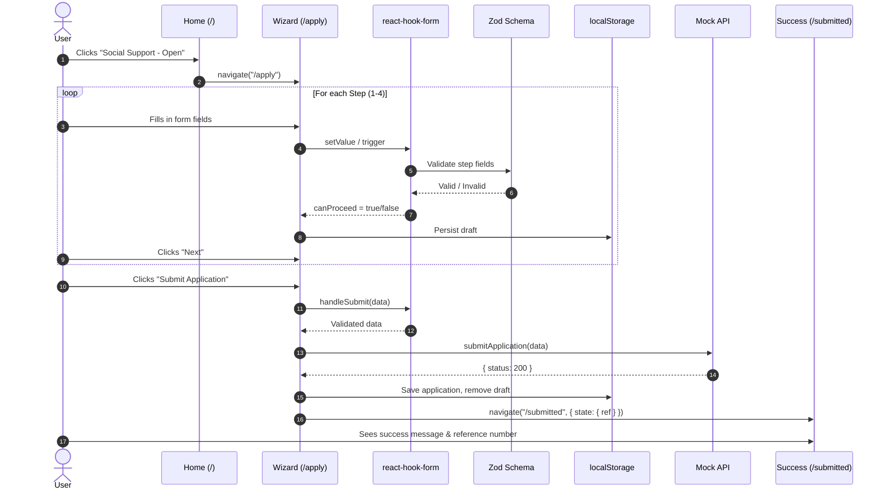

# Architecture

This document provides a technical deep-dive into the **TAMM Social Support Portal**. It covers the stack decisions, data flow, state management, and design patterns used throughout the application.

---

## Tech Stack

| Layer                    | Technology            | Purpose                                              |
| :----------------------- | :-------------------- | :--------------------------------------------------- |
| **Build & Runtime**      | Vite + Node 22        | Fast builds, HMR, modern ES modules                  |
| **UI Framework**         | React 18 + TypeScript | Component-based UI with strong typing                |
| **Component Library**    | Material UI (MUI) v5  | Accessible, themeable component primitives           |
| **Forms**                | react-hook-form + Zod | Performant form state with schema-based validation   |
| **Internationalization** | react-i18next         | Multi-language support (EN/AR/RTL)                   |
| **Routing**              | react-router-dom v6   | Declarative client-side routing                      |
| **State**                | React Context API     | Lightweight global state (notifications, app config) |
| **Persistence**          | LocalStorage          | Draft saving, chat history, application tracking     |
| **AI**                   | OpenAI API (GPT-3.5)  | Text generation for "Help Me Write" feature          |

---

## Project Structure

```
tamm-social-support/
├── public/                     # Static assets
├── src/
│   ├── assets/                 # Images, icons, mock data
│   │   └── mock/services.json
│   ├── components/             # Reusable UI components
│   │   ├── NavBar.tsx
│   │   ├── Footer.tsx
│   │   ├── Chatbot.tsx
│   │   ├── LanguageSwitch.tsx
│   │   ├── FormStepper.tsx
│   │   ├── HelpMeWriteDialog.tsx
│   │   └── ValidatedTextField.tsx
│   ├── context/
│   │   └── AppContext.tsx      # Global notification provider
│   ├── hooks/
│   │   └── useFormPersist.ts   # Auto-save form drafts
│   ├── pages/
│   │   ├── Home.tsx            # Landing page
│   │   ├── Dashboard.tsx       # Application status tracking
│   │   ├── ApplicationTracker.tsx
│   │   └── form/
│   │       ├── Wizard.tsx      # Main form orchestrator
│   │       ├── Step1.tsx       # Personal Information
│   │       ├── Step2.tsx       # Family & Financial
│   │       ├── Step3.tsx       # Situation Descriptions + AI
│   │       ├── Step4.tsx       # Document Uploads
│   │       └── SubmissionSuccess.tsx
│   ├── schema/
│   │   └── applicationSchema.ts # Zod schema (i18n-aware)
│   ├── constants/
│   │   ├── defaultValues.ts
│   │   └── stepFields.ts
│   ├── services/
│   │   ├── api.ts              # Mock API + OpenAI integration
│   │   └── tammInformation.ts  # Chatbot knowledge base
│   ├── locales/
│   │   ├── en/translation.json
│   │   └── ar/translation.json
│   ├── theme.ts                # Custom TAMM MUI theme
│   ├── i18n.ts
│   ├── App.tsx
│   └── main.tsx
├── .env.example
├── README.md
├── assignment.md
├── enhancements.md
└── Architecture.md             # This file
```

---

## Application Flow

### 1. Landing Page (`/`)

- Hero banner showcasing available services.
- Clicking **"Social Support → Open"** navigates to `/apply`.
- Other services display a **"Coming Soon"** dialog.

### 2. Application Wizard (`/apply`)

- **4-step wizard** with a progress bar:
  1.  **Personal Information:** Name, ID, Contact details.
  2.  **Family & Financial Info:** Marital status, dependents, income.
  3.  **Situation Descriptions:** Free-text areas with AI "Help Me Write".
  4.  **Document Uploads:** National ID, Proof of Address, Income Proof.
- **Validation:** Inline, per-step validation. "Next" button is disabled until the step is valid.
- **Persistence:** Form data is auto-saved to `localStorage`.

### 3. Submission & Success (`/submitted`)

- Mock API call with a simulated loading state.
- On success, the user is presented with a unique **Reference Number**.
- The application is saved to `localStorage` for viewing on the Dashboard.

### 4. Dashboard (`/dashboard`)

- Displays all tracked applications.
- Shows status (Submitted, In Review, Approved), timeline, and progress.

---

## Form & Validation Architecture

This application uses **react-hook-form** for state management and **Zod** for schema validation.

### Key Design Decisions

1.  **I18n-Aware Schemas:** The `applicationSchema` is a function `buildApplicationSchema(t)` that takes the i18n `t` function, allowing all validation error messages to be translated.

2.  **Per-Step Validation:** The `STEP_FIELDS` constant maps each wizard step to a list of field paths. The `Wizard.tsx` component uses `methods.trigger()` on these paths to enable/disable the "Next" button.

3.  **Performance:** We avoid `useWatch({ control })` on the entire form object to prevent expensive re-renders. Instead, we watch only the fields relevant to the current step.

```tsx
// Wizard.tsx - Efficient step validation
const currentStepFields = STEP_FIELDS[active];
const watchedValues = methods.watch(currentStepFields as any);

useEffect(() => {
  const checkValidity = async () => {
    const ok = await methods.trigger(currentStepFields, { shouldFocus: false });
    setCanProceed(ok);
  };
  checkValidity();
}, [JSON.stringify(watchedValues), active]);
```

---

## Internationalization (i18n)

- **`i18n.ts`** initializes `react-i18next` with language detection and loads `locales/en|ar/translation.json`.
- The `LanguageSwitch` component toggles the language and sets `document.dir` for RTL layout.
- **Every visible string** is wrapped in `t(...)` for translation.

### RTL Handling

- MUI's `direction: 'rtl'` is set dynamically in `theme.ts` based on the active language.
- Custom component styles use logical properties or conditional `sx` values where needed.

---

## State Management

| Scope           | Mechanism                        | Example                                |
| :-------------- | :------------------------------- | :------------------------------------- |
| **Global**      | `AppContext`                     | Toast notifications, app-wide config   |
| **Form**        | `react-hook-form` `FormProvider` | All wizard step data                   |
| **Component**   | `useState` / `useReducer`        | Dialog visibility, loading states      |
| **Persistence** | `localStorage`                   | Form draft, chat history, applications |

---

## AI Integration ("Help Me Write")

Located in `src/components/HelpMeWriteDialog.tsx` and `src/services/api.ts`.

### Flow

1.  User clicks "Help Me Write" button on a text field in Step 3.
2.  A seed prompt is constructed from the user's existing form data (e.g., employment status, income).
3.  A request is sent to the **OpenAI Chat Completions API** (`gpt-3.5-turbo`).
4.  The generated text is displayed in a dialog.
5.  User can **Accept**, **Edit**, or **Discard** the suggestion.

### Error Handling

- API timeouts and failures are caught gracefully.
- A user-friendly error message is displayed within the dialog.

---

## Theming

The custom theme in `src/theme.ts` is inspired by the official TAMM government portal.

### Color Palette

| Role              | Color                   | Usage                         |
| :---------------- | :---------------------- | :---------------------------- |
| **Primary**       | `#169F9F` (Teal)        | Buttons, links, active states |
| **Primary Hover** | `#0eecda` (Bright Cyan) | Button hover effects          |
| **Secondary**     | `#12121b` (Dark Grey)   | Text, backgrounds             |
| **Success**       | `#2B8432`               | Validation success indicators |

### Component Overrides

- **Buttons:** Pill-shaped (`borderRadius: 160`) with hover animations.
- **Cards/Paper:** Subtle shadows and `12px` border radius.
- **TextFields:** Focus glow effect using the primary color.

---

## Deployment

### Vercel (Recommended)

1.  Push code to GitHub.
2.  Import project in Vercel, select **Vite** preset.
3.  Add `VITE_OPENAI_API_KEY` to environment variables.
4.  Deploy.

### Static Hosting

- The Vite build output (`dist/`) is a fully static SPA.
- No server-side rewrites are needed for `BrowserRouter`.

---

## Sequence Diagram: User Journey



---

## Lessons Learned & Gotchas

- **`useWatch` on the entire form** causes performance issues. Target specific fields.
- **Overlay elements** (banners, decorative images) can intercept clicks. Use `pointerEvents: 'none'`.
- **MUI Select:** Can shrink unexpectedly. Enforce `minWidth` via `sx`.
- **RTL layouts:** Test thoroughly. Not all MUI components handle RTL perfectly out of the box.
